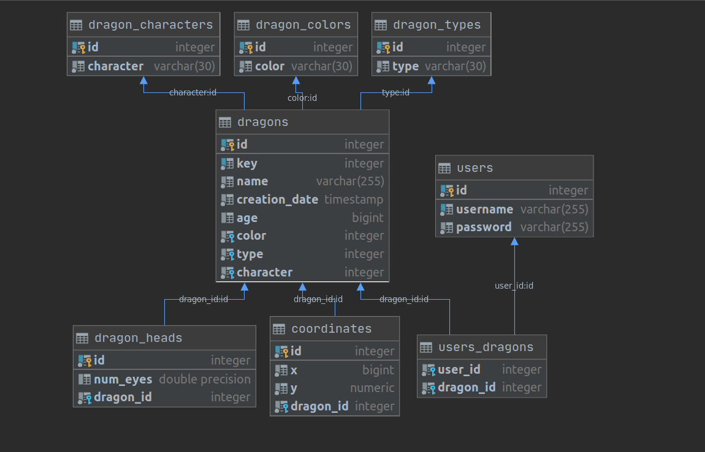

# Progra Lab7 ITMO-2020

**Variant**: 3132331

#### Commands:
* The operating mode is defined by the environment variable mode
* For remote server mode-Dmode=server
* To work in client mode, to connect to the server-Dmode=client

**Client:** 

First represents the mode of operating, second the port to the server we want to connect
```
java -jar -Dmode=client Progra_Lab6.jar 5433
java -jar -Dmode=client Progra_Lab6.jar 5433 localhost
```

First represents the mode of operating, second the port to the server we want to connect and the last is the name of the file from which we take the Dragons for the collection.

**Server:** 
```
java -jar -Dmode=server Progra_Lab6.jar 5433 data.xml
```

**Database Structure:**

The db configuration is taken from the resources file 'db.properties'

And with the file generate_db_script.sql is possible to generate the database ready to run.




#### Порядок выполнения работы:
* В качестве базы данных использовать PostgreSQL.
* Для подключения к БД на кафедральном сервере использовать хост `pg`, имя базы данных - `studs`, имя пользователя/пароль совпадают с таковыми для подключения к серверу. 
* Данные для подключения к почтовому серверу уточняются.

#### Доработать программу из лабораторной работы №6 следующим образом:

* Организовать хранение коллекции в реляционной СУБД (PostgresQL). Убрать хранение коллекции в файле.
* Для генерации поля id использовать средства базы данных (sequence).
* Обновлять состояние коллекции в памяти только при успешном добавлении объекта в БД
* Все команды получения данных должны работать с коллекцией в памяти, а не в БД
* Организовать возможность регистрации и авторизации пользователей. У пользователя есть возможность указать пароль.
* Пароли при хранении хэшировать алгоритмом `SHA-256`
* Запретить выполнение команд не авторизованным пользователям.
* При хранении объектов сохранять информацию о пользователе, который создал этот объект.
* Пользователи должны иметь возможность просмотра всех объектов коллекции, но модифицировать могут только принадлежащие им.
* Для идентификации пользователя отправлять логин и пароль с каждым запросом.

#### Необходимо реализовать многопоточную обработку запросов:
* Для многопоточного чтения запросов использовать `Cached thread pool`
* Для многопотчной обработки полученного запроса использовать `создание нового потока (java.lang.Thread)`
* Для многопоточной отправки ответа использовать `создание нового потока (java.lang.Thread)`
* Для синхронизации доступа к коллекции использовать `синхронизацию чтения и записи с помощью java.util.concurrent.locks.ReentrantLock`
